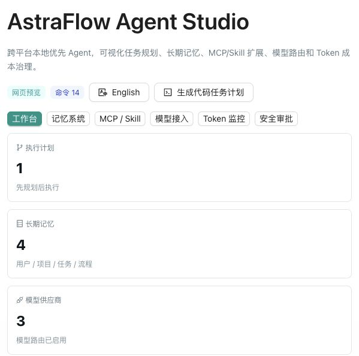
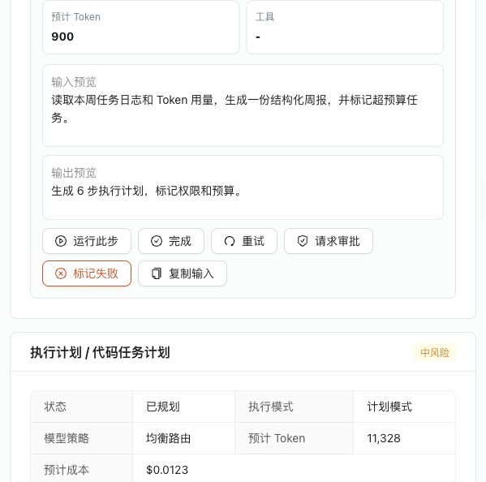
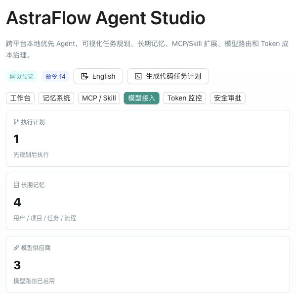
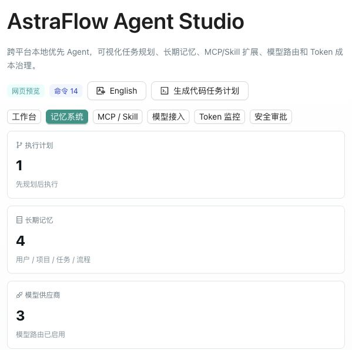

# AstraFlow Agent Studio

**AstraFlow Agent Studio（星流智能体工作台）** 是一个本地优先、跨平台、可视化的智能体桌面应用。它面向“通用工作流 Agent”场景，把任务规划、上下文编排、长期记忆、MCP/Skill 扩展、模型接入、沙箱审批和 Token 成本治理集中到一个产品级工作台里。

技术栈：

- 桌面端：Tauri 2
- 前端：React + TypeScript + Vite
- UI：Ant Design / ECharts / React Flow
- 本地运行层：Rust Tauri commands + TypeScript runtime 原型
- 密钥：桌面端使用系统钥匙串，前端只保存脱敏标记

## 产品截图

### 工作台总览



### 可操作 Agent Canvas



### 模型接入中心



### 记忆系统



## 核心能力

### Agent Canvas

Agent Canvas 使用 React Flow 展示一次 Agent 执行链路，包括 Planner、Memory、Context、MCP Tool、Skill、Model Call、Approval、Result 等节点。它不只是静态流程图，当前版本已经支持直接操作节点：

- 点击节点查看步骤说明、输入预览、输出预览、预计 Token、工具或模型。
- 将单个步骤切换为运行中、已完成、待审批或失败。
- 支持重试步骤、复制节点输入、请求审批。
- 操作会写入 Runtime Log，方便追踪人工介入和执行状态变化。

### 任务入口

任务入口采用聊天式输入，支持一句话描述任务，并支持两种执行模式：

- 计划模式：生成 Task Plan / Coding Plan，等待用户审批后继续执行。
- 直接执行：低/中风险任务可自动模拟执行，高风险任务会自动进入审批状态。

任务入口还支持：

- 本机工作区路径选择。
- 文件上传。
- 图片上传。
- 多模态任务附件写入上下文报告。
- 软预算和硬预算配置。
- 模型路由策略选择。

### Task Plan / Coding Plan

每个任务会先生成结构化执行计划：

- 步骤列表。
- 风险等级。
- 需要的权限。
- 预计工具调用。
- 预计 Token 和成本。

如果任务涉及代码，会额外生成 Coding Plan：

- 影响区域。
- 修改策略。
- 验证命令。
- 回滚建议。

这样可以把“Agent 想做什么”提前暴露给用户，避免黑盒自动化。

### Token Plan / Token Monitor

Token Monitor 用来做成本治理，支持按任务、模型、Provider 聚合：

- prompt tokens。
- completion tokens。
- embedding tokens。
- cached tokens。
- 缓存命中率。
- 缓存单独成本。
- 总费用估算。
- 今日和本周消耗。

Provider 连通测试成功后，也会写入一条 usage entry，方便验证模型接入成本统计是否正常。

### Memory System

记忆系统支持四类长期记忆：

- Profile Memory：用户偏好、常用路径、常用模型。
- Project Memory：项目结构、文档摘要、关键约束。
- Episodic Memory：历史任务、失败原因、成功路径。
- Procedural Memory：可复用流程和 Skill 使用经验。

每条记忆都包含：

- 类型。
- 内容。
- 来源。
- 置信度。
- 创建时间。
- 更新时间。
- 启用状态。
- embedding id。

界面中可以直接添加、编辑、禁用、删除记忆。禁用后的记忆不会参与检索和上下文注入。

### Context Inspector

Context Inspector 展示一次任务实际进入模型的上下文片段，并按优先级排序：

1. 当前任务。
2. 用户明确输入。
3. 已选择文件或网页。
4. 相关记忆。
5. Skill 指令。
6. 历史摘要。

当上下文超出预算时，Context Compiler 会裁剪低优先级内容，并在 Inspector 中展示被裁剪片段。当前预算足够时，不展示多余的“被裁剪内容”空区块。

### MCP Center

MCP Center 面向标准 Model Context Protocol 扩展：

- 支持 stdio。
- 支持 HTTP/SSE。
- 支持安装、启用、禁用。
- 支持健康状态展示。
- 支持权限声明。
- 支持从一句话生成 MCP Server 配置草稿。

MCP Server 不直接获得系统权限，后续会统一走本地 Runtime 的权限层和审批层。

### Skill Store

Skill 是 AstraFlow 自己的可安装能力包格式，包含：

- `skill.json` 风格 Manifest。
- `SKILL.md` 入口说明。
- 可选脚本。
- 可选资源文件。
- 权限声明。

当前界面支持一句话生成 Skill 配置草稿，新安装的 Skill 默认不自动启用，需要用户确认。

### Provider Hub

Provider Hub 统一管理国内外模型 API，支持：

- OpenAI-compatible。
- Anthropic Messages。
- Gemini generateContent。
- 小米 MiMo。
- DeepSeek。
- Qwen。
- Kimi。
- Zhipu。
- Ollama。

模型名称、Base URL、上下文长度、价格表和路由标签都可以由用户维护，不硬编码为唯一选择。

桌面端的 Provider 测试和 API Key 保存已经迁入 Tauri 后端：

- 明文 API Key 由 Rust command 写入系统钥匙串。
- macOS 使用 Keychain。
- Windows 使用系统凭据存储。
- 前端 Zustand 状态只保存 `maskedKey`。
- 真实 Provider 测试由 Tauri 后端发请求。
- API Key 不写入日志，也不进入模型上下文。

Vite 网页预览模式没有系统钥匙串能力，只保留脱敏标记，适合开发调试。

### Sandbox & Approval

安全策略按风险分层：

- 低风险：读取文件、搜索、总结，可自动执行。
- 中风险：写文件、调用外部 API，需要任务级授权。
- 高风险：删除文件、执行 Shell、访问密钥、部署、Git push，必须人工审批。

当前版本已经有风险识别、审批状态、运行日志和可操作画布；后续可以接入 Docker/Podman 沙箱执行器。

## 架构设计

```text
┌──────────────────────────────────────────────┐
│              React / TypeScript UI            │
│  Task Composer / Canvas / Provider / Memory   │
└──────────────────────┬───────────────────────┘
                       │ Tauri invoke
┌──────────────────────▼───────────────────────┐
│              Tauri 2 Native Layer             │
│ Provider Test / Keychain / Dialog / Commands  │
└──────────────────────┬───────────────────────┘
                       │
┌──────────────────────▼───────────────────────┐
│          Local Agent Runtime Prototype        │
│ Planner / Context Compiler / Usage / Security │
└──────────────────────┬───────────────────────┘
                       │
┌──────────────────────▼───────────────────────┐
│          Local Data & Extension Layer         │
│ SQLite target / LanceDB target / MCP / Skill  │
└──────────────────────────────────────────────┘
```

当前代码中已经实现：

- Tauri command 映射。
- Provider 测试后端代理。
- 系统钥匙串写入和读取。
- Planner。
- Context Compiler。
- Memory CRUD。
- Skill / MCP Manifest 校验。
- Usage aggregation。
- 风险识别。
- 可视化 Agent Canvas 操作。

SQLite、LanceDB、MCP 进程管理和真实任务队列是下一阶段重点。

## 目录结构

```text
.
├── docs/
│   └── screenshots/          # README 截图
├── sidecar/                  # Node.js/TypeScript Agent Runtime 原型
├── src/
│   ├── components/           # 工作台 UI 组件
│   ├── desktop/              # Tauri command 映射和桌面能力封装
│   ├── domain/               # 核心类型定义
│   ├── runtime/              # Planner、Context、Provider、Usage、安全逻辑
│   ├── store/                # Zustand 本地状态与持久化
│   └── styles/               # 产品界面样式
├── src-tauri/                # Tauri 2 桌面壳和 Rust 后端命令
├── README.md
└── package.json
```

## 快速启动

安装依赖：

```bash
npm install
```

启动网页预览：

```bash
npm run dev
```

默认地址：

```text
http://127.0.0.1:5173/
```

## 启动桌面端

首次运行桌面端需要安装 Rust：

```bash
curl --proto '=https' --tlsv1.2 -sSf https://sh.rustup.rs | sh
```

启动 Tauri 开发模式：

```bash
npm run tauri:dev
```

## 打包与安装

构建前端：

```bash
npm run build
```

构建 Tauri release 二进制，不生成安装包：

```bash
npx tauri build --no-bundle
```

构建完整桌面安装包：

```bash
npm run tauri:build
```

macOS `.app` 产物位置：

```text
src-tauri/target/release/bundle/macos/AstraFlow Agent Studio.app
```

macOS 安装到 Applications：

```bash
rm -rf "/Applications/AstraFlow Agent Studio.app"
cp -R "src-tauri/target/release/bundle/macos/AstraFlow Agent Studio.app" "/Applications/"
```

如果 DMG 打包脚本在本机环境失败，可以先使用 `.app` 产物安装运行；release 二进制和 `.app` 仍然是有效的桌面应用产物。

## 常用脚本

```bash
npm run dev          # 启动 Vite 预览
npm run build        # TypeScript + Vite 构建
npm run lint         # ESLint 检查
npm run test         # 运行 Vitest 单元测试
npm run runtime:dev  # 启动 Node.js sidecar 原型
npm run tauri:dev    # 启动 Tauri 桌面端
npm run tauri:build  # 构建桌面安装包
```

## 测试覆盖

当前测试覆盖：

- Provider Adapter 请求格式。
- Anthropic / Gemini / OpenAI-compatible usage 解析。
- Context Compiler 排序、裁剪和预算逻辑。
- Planner 风险识别和 Coding Plan 生成。
- Memory 来源追踪和检索逻辑。
- Skill Manifest 校验。
- MCP Manifest 校验。
- 安全策略基础规则。
- Usage 聚合与缓存成本计算。

当前验证命令：

```bash
npm run build
npm run lint
npm run test
cargo check --manifest-path src-tauri/Cargo.toml
npx tauri build --no-bundle
```

## 当前产品状态

已经完成：

- 产品级中文界面。
- 中英文切换。
- 聊天式任务入口。
- 计划模式 / 直接执行切换。
- 工作区选择。
- 文件和图片上传。
- Task Plan / Coding Plan。
- 可操作 Agent Canvas。
- Context Inspector。
- Memory CRUD。
- MCP / Skill 安装入口。
- Provider Hub。
- OpenAI-compatible / Anthropic / Gemini Provider Adapter。
- 小米 MiMo、DeepSeek、Qwen、Kimi、Zhipu、Ollama 预设。
- Token Monitor。
- 缓存命中率和缓存价格统计。
- Tauri Provider 后端测试。
- 系统钥匙串 API Key 保存。
- macOS `.app` 打包和安装。

下一阶段建议：

- SQLite 真实任务、日志、配置落库。
- LanceDB 真实向量记忆检索。
- MCP stdio / HTTP/SSE 真实会话管理。
- Skill 包下载、校验和版本管理。
- Docker/Podman 沙箱执行器。
- 真实 Agent 任务队列和中断恢复。
- 审批弹窗与权限审计日志。
- macOS / Windows 签名、自动更新和正式安装器。

## License

当前仓库为私有产品原型，暂未声明开源许可证。
